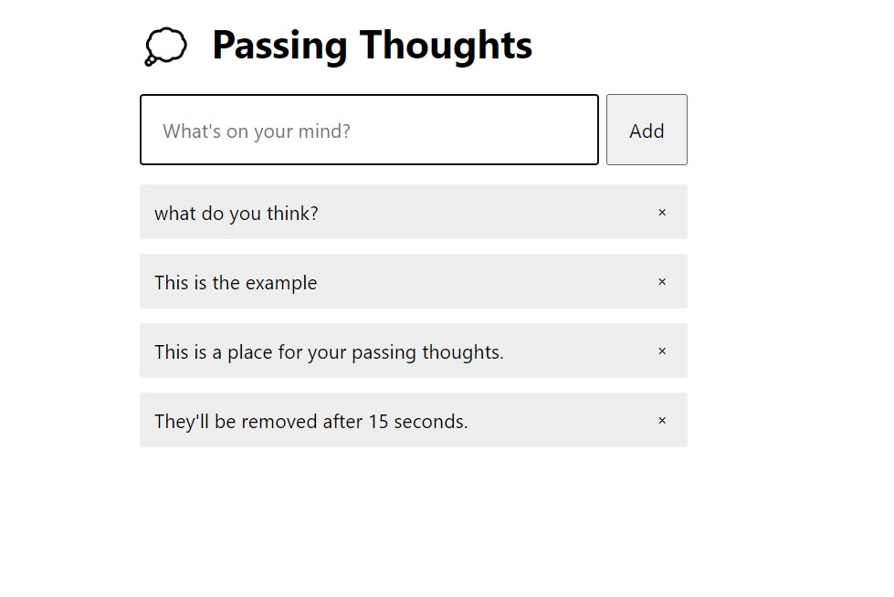

# Passing Thoughts Application

I made this project for training and to learn to use the React Hooks in a funny way.

The application supports the next features:
+ Enter a pair of words in the input field and press the "**Add**" button to add them to the list.
+ You can delete the words by pressing the "**x**" button.
+ You can wait up to 15 seconds for the words to be deleted automatically.

In this project I used the acquired knowledge about Javascript Async, React Function Components and React Hooks.

